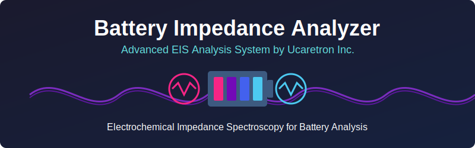
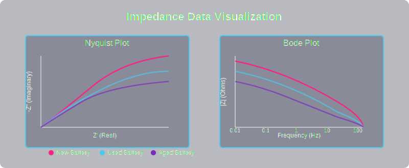

# Battery Impedance Analyzer

Advanced Electrochemical Impedance Spectroscopy (EIS) Analysis System by Ucaretron Inc.



## 🔋 Overview

Battery Impedance Analyzer is a comprehensive software toolkit for electrochemical impedance spectroscopy (EIS) analysis of batteries. This system implements the patented technology by Ucaretron Inc. for integrated thermal-electrical impedance analysis, providing deeper insights into battery performance, health, and aging characteristics.


## ✨ Key Features

- **Real-time Impedance Analysis**: Continuous monitoring with fast acquisition rates
- **Multi-frequency EIS**: Wide frequency range analysis (10kHz - 1mHz)
- **Temperature Correlation**: Integrated thermal-electrical impedance analysis
- **State of Health (SOH) Estimation**: Advanced algorithms for battery health assessment
- **Degradation Prediction**: ML-based predictive models for remaining useful life
- **Battery Selection Optimization**: Optimized battery pack construction through impedance matching
- **Fault Detection**: Early warning system for battery failures

## 🔍 System Architecture

The software is designed with a modular architecture to enable flexible integration with various hardware systems and analysis requirements.



## 📊 Impedance Data Visualization

The toolkit provides comprehensive visualization tools for impedance data analysis, including Nyquist plots, Bode plots, and equivalent circuit model fitting.



## ⚙️ Workflow

Our integrated analysis workflow ensures accurate and reliable results:


## 🚀 Getting Started

### Prerequisites
- Python 3.8 or higher
- NumPy, SciPy, Matplotlib
- PyQt5 (for GUI components)

### Installation

```bash
# Clone the repository
git clone https://github.com/JJshome/battery-impedance-analyzer.git
cd battery-impedance-analyzer

# Install dependencies
pip install -r requirements.txt

# Run the application
python src/main.py
```

## 📝 Usage Examples

### Basic Impedance Measurement

```python
from battery_analyzer import ImpedanceAnalyzer

# Initialize the analyzer
analyzer = ImpedanceAnalyzer()

# Connect to the measurement hardware
analyzer.connect(port='/dev/ttyUSB0')

# Run a frequency sweep from 10kHz to 10mHz
data = analyzer.measure_impedance(freq_start=10000, freq_end=0.01, points=50)

# Plot the Nyquist diagram
analyzer.plot_nyquist(data)

# Export the results
analyzer.export_data(data, "results.csv")
```

### Battery Health Assessment

```python
from battery_analyzer import BatteryHealth

# Initialize with a battery model
health_analyzer = BatteryHealth(model='lithium_ion_18650')

# Load impedance data
health_analyzer.load_data("impedance_data.csv")

# Fit equivalent circuit model
params = health_analyzer.fit_circuit_model('randles')

# Calculate state of health
soh = health_analyzer.calculate_soh()
print(f"Battery State of Health: {soh:.2f}%")

# Generate comprehensive report
health_analyzer.generate_report("battery_health_report.pdf")
```

## 📚 Documentation

Comprehensive documentation is available in the [docs](./docs) directory:

- [User Guide](./docs/user_guide.md): Detailed instructions for using the software
- [API Reference](./docs/api_reference.md): Complete API documentation
- [Technical Background](./docs/technical.md): EIS principles and analysis methods
- [Hardware Integration](./docs/hardware.md): Guide for integrating with measurement hardware

## 🔬 Scientific Background

This software implements methodologies based on the following scientific principles:

- Electrochemical Impedance Spectroscopy (EIS)
- Equivalent Circuit Modeling
- Thermal-Electrical Correlation Analysis
- Machine Learning for Parameter Extraction
- Battery Aging Models

## 📄 License

This project is licensed under the MIT License - see the [LICENSE](LICENSE) file for details.

---

*Battery Impedance Analyzer - Advancing battery analysis through integrated thermal-electrical impedance spectroscopy*